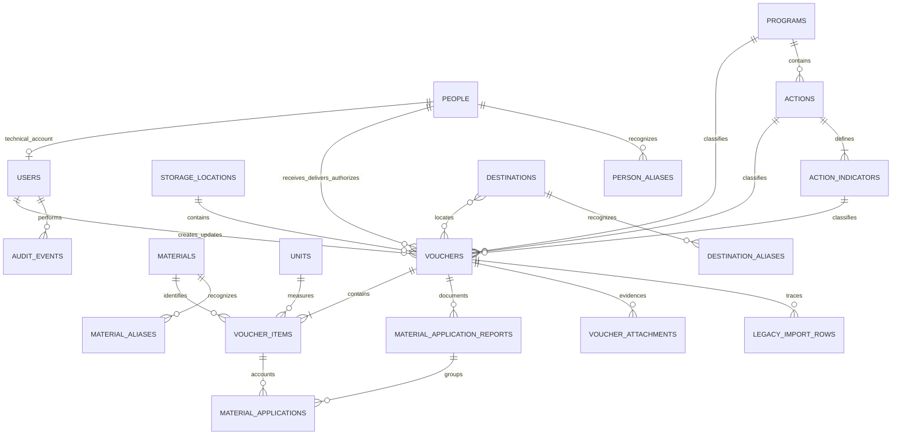

# Arquitectura y modelo de datos

## Vista general

La aplicación es un monolito Laravel con páginas Inertia y React. No existe una API pública separada.

```text
Navegador React/TypeScript
        │ Inertia + formularios HTTP
        ▼
Rutas web protegidas por sesión, CSRF y correo verificado
        │
        └── enlace firmado temporal para consulta externa de un vale
        ▼
Controladores Laravel ── políticas, validación y transacciones
        ▼
Servicios de dominio y modelos Eloquent
        ▼
PostgreSQL + almacenamiento privado de adjuntos
```

- Laravel controla autenticación, autorización, validación, transacciones y descarga privada. La única excepción es la consulta externa de un vale mediante URL firmada con expiración.
- React renderiza formularios, catálogos, detalle de vales, dashboard y seguimiento.
- PostgreSQL conserva documentos, movimientos, catálogos, auditoría y trazabilidad de importación.
- OpenSpout se utiliza para leer y generar XLSX sin cargar libros completos en memoria.

## Servicios de dominio

- `Normalizer`: genera claves comparables para folios, materiales, ubicaciones y personas.
- `VoucherSequence`: detecta huecos numéricos por tipo a partir de los inicios configurados. Las trazas inválidas pueden extender el último folio observado, pero nunca cuentan como folios presentes.
- `VoucherData`: construye el contrato de presentación de un vale y calcula los estados de sus partidas.
- `SharedVoucherData`: deriva una proyección pública limitada de `VoucherData` y genera URLs firmadas para los comprobantes del vale.
- `Voucher::visibleTo(User)`: conserva todos los vales para administradores y limita al técnico a salidas activas propias desde el corte de 2026.
- `MaterialTracking`: aplica el corte de 2026 y agrega partidas por material/unidad o por técnico.
- `CatalogIndexData`: valida la sección y los filtros de Catálogos, limita las consultas a los datos visibles y construye su navegación y paginación.
- `LegacyControlWorkbook`: lee únicamente las hojas de Almacén y Patio y selecciona agosto de 2026.
- `ImportLegacyControl`: valida, prepara y escribe la importación histórica dentro de una transacción.

La pantalla y el XLSX de seguimiento consumen el mismo agregador para evitar resultados divergentes.

Las consultas de vales y seguimiento comparten el mismo alcance por tipo de vale. El parámetro `voucher_type_id` acepta un identificador activo o `all`; cuando se omite, el sistema usa Almacén (`warehouse`). El frontend conserva este alcance en ordenamiento, paginación, enlaces de detalle y exportación, y actualiza los resultados mediante visitas parciales de Inertia. El resumen no acepta este filtro: siempre agrega Almacén y Patio en un panorama general.

Vales, Mis vales, Seguimiento y su exportación aceptan el parámetro textual `search`. La búsqueda localiza vales completos por folio u orden de servicio vigente; Seguimiento además busca técnico receptor, destino, descripción de actividad o material. El selector rápido reutiliza el alcance de folio u orden y conserva sus filtros de salida activa con saldo pendiente. Las aplicaciones anuladas no producen coincidencias.

Catálogos acepta `section=people|materials|destinations|programs` y abre Personas cuando el parámetro falta o es inválido. Personas, Materiales y Ubicaciones se consultan en páginas de 25 registros; el programa fijo, las acciones y los indicadores se presentan juntos. `search`, `status` y `review` se aplican en el servidor, con `role` exclusivo de Personas y `voucher_type_id` exclusivo de Materiales. La búsqueda de nombres usa claves normalizadas y alias. Los cambios de filtro y página reemplazan únicamente las props `catalog` y `filters` mediante visitas parciales de Inertia; las unidades y tipos de vale sólo se cargan para la sección que los necesita.

## Relaciones principales



## Diccionario resumido

| Tabla                          | Responsabilidad                                                                                                                                                                                                                       |
| ------------------------------ | ------------------------------------------------------------------------------------------------------------------------------------------------------------------------------------------------------------------------------------- |
| `users`                        | Cuentas autorizadas con rol fijo, usuario opcional, correo opcional y vínculo único a persona para técnicos. Las cuentas técnicas no usan correo; `is_active` bloquea inmediatamente el acceso.                                                                            |
| `people.charge_number`         | Número de cobro único y confidencial. Es nullable durante la conciliación controlada; cuando existe una cuenta técnica es obligatorio y determina su contraseña. |
| `storage_locations`            | Configuración estructural de los tipos de vale Almacén y Patio; no expone rutas de administración.                                                                                                                                    |
| `material_storage_location`    | Relación editable que limita qué materiales se pueden capturar en cada tipo de vale.                                                                                                                                                  |
| `units`                        | Unidad estructurada usada para cantidades; `decimal_places` distingue las unidades enteras de las que admiten fracciones de hasta tres posiciones.                                                                                  |
| `materials`                    | Catálogo canónico; conserva unidad habitual, bandera de revisión y la clasificación editable que identifica luminarias.                                                                                                               |
| `material_aliases`             | Variantes históricas que apuntan al material canónico.                                                                                                                                                                                |
| `people`                       | Técnicos y personal; sus banderas indican quién recibe, entrega o autoriza.                                                                                                                                                           |
| `person_aliases`               | Escrituras alternativas de una misma persona.                                                                                                                                                                                         |
| `programs`                     | Programa fijo de toda salida activa, de Almacén o Patio, inicialmente SPM-06.                                                                                                                                                         |
| `actions`                      | Las 17 acciones oficiales subordinadas al programa fijo SPM-06.                                                                                                                                                                       |
| `action_indicators`            | Los 21 indicadores oficiales; cada acción tiene uno o dos y conserva código y nombre breve.                                                                                                                                           |
| `destinations`                 | Ubicaciones geográficas reutilizables, activables y normalizadas.                                                                                                                                                                     |
| `destination_aliases`          | Abreviaturas, nombres alternativos o anteriores que apuntan a una ubicación canónica; nunca contienen actividades.                                                                                                                    |
| `destination_voucher`          | Relación de una o varias ubicaciones con cada vale.                                                                                                                                                                                   |
| `vouchers`                     | Cabecera del documento, estado, revisión y responsables.                                                                                                                                                                              |
| `voucher_items`                | Cantidad entregada o prestada, según el estado del vale, referencias al material y unidad canónicos y folios descriptivos opcionales para luminarias; la descripción se mantiene sincronizada para búsquedas y presentación.             |
| `material_application_reports` | Agrupa una aplicación capturada en bloque: fecha, tipo y número de orden de servicio, ubicación o dirección libre, detalles comunes, desglose de materiales y evidencia opcional. Los históricos pueden conservar orden y tipo nulos. |
| `material_applications`        | Cantidad aplicada a una partida; una anulación conserva fecha, usuario y motivo.                                                                                                                                                      |
| `voucher_attachments`          | Metadatos de evidencia guardada en almacenamiento privado.                                                                                                                                                                            |
| `audit_events`                 | Valores anteriores y posteriores de operaciones sensibles.                                                                                                                                                                            |
| `legacy_import_rows`           | Copia del renglón original, incidencias y vínculo al registro importado.                                                                                                                                                              |
| `inventory_adjustments`        | Infraestructura reservada de inventario físico; no tiene rutas activas.                                                                                                                                                               |

## Invariantes

- `vouchers(storage_location_id, folio_key)` es único. `folio_key` deriva del folio normalizado.
- Las cantidades se almacenan con decimal de tres posiciones por compatibilidad de datos. Cada unidad restringe las capturas nuevas a enteros o a un máximo de tres decimales; Metro y Litro admiten fracciones y la interfaz sugiere un decimal. Las cantidades deben ser positivas, salvo el cero usado para anular una aplicación desde su edición.
- Una aplicación nueva requiere tipo y número de orden de servicio y no puede superar el pendiente; las partidas se bloquean durante la transacción para evitar carreras. Los tipos se validan contra un enum extensible que inicialmente ofrece Normal y 072; la columna se conserva como texto para permitir nuevas opciones mediante cambios de aplicación sin alterar el esquema.
- Una aplicación anulada deja de afectar las sumas, pero permanece auditable. Corregir una cantidad requiere motivo, anula el valor anterior y crea su reemplazo dentro del mismo grupo de aplicación. Al cancelar un vale, la administradora puede anular todas sus aplicaciones vigentes con un motivo técnico automático o conservarlas como antecedente de sólo lectura.
- Una partida con aplicaciones vigentes no puede cambiar de material, cantidad ni eliminarse; primero se anulan las aplicaciones con motivo. En un vale convertido a prestado, cualquier partida con historial de aplicaciones permanece bloqueada aunque sus aplicaciones estén anuladas, para conservar ese antecedente.
- La unidad de cada partida siempre deriva de la unidad predeterminada del material. Corregir el nombre o la unidad canónica del material se propaga a todos sus vales, conserva la cantidad numérica y deja auditoría.
- No se puede reducir la precisión de una unidad ni cambiar un material a una unidad entera cuando sus partidas, aplicaciones o ajustes relacionados contienen fracciones incompatibles; nunca se redondean para permitir el cambio.
- Los códigos y relaciones de SPM-06, acciones e indicadores son inmutables; acciones e indicadores sólo permiten corregir nombre y estado.
- No se puede desactivar una unidad usada por materiales activos, la última persona activa para una función necesaria, la última acción disponible ni el último indicador de una acción activa.
- Un registro de catálogo sólo se elimina si no referencia vales ni otras dependencias que perderían información: unidades no usadas por materiales, partidas o ajustes reservados, y personas que no sean la última persona activa para una función necesaria. El programa SPM-06, sus acciones e indicadores no se eliminan desde la aplicación; únicamente se corrigen sus nombres y estados. La eliminación permitida deja auditoría y la base restringe las referencias históricas.
- Un vale activo puede cancelarse con una razón opcional. Si se solicita anular sus aplicaciones vigentes, todas se bloquean y anulan dentro de la misma transacción; si se conservan, permanecen visibles como antecedente de sólo lectura. En ambos casos el vale cancelado queda fuera del seguimiento y la operación conserva fecha, usuario y auditoría.
- La administradora puede eliminar definitivamente cualquier vale como corrección excepcional de una captura equivocada. La operación borra en cascada sus relaciones, elimina archivos privados, auditorías y traza de importación y no crea un evento de eliminación. Los técnicos nunca disponen de esta capacidad.
- Un cancelado mínimo puede crearse sin movimiento, personas, destino ni partidas para conservar la serie física.
- Las partidas de una salida cancelada se conservan sin alterar `quantity` ni el cálculo histórico `pendiente = entregado - aplicado`; la interfaz las clasifica como material sin usar y el estado cancelado excluye el vale de la responsabilidad operativa. Esta clasificación no crea entradas, devoluciones ni ajustes de inventario.
- Un prestado conserva tipo, folio y fecha; puede asociar opcionalmente un técnico, un nombre libre de persona responsable y partidas de material. También puede derivarse de un vale activo mediante una conversión administrativa auditada que conserva sus campos, relaciones y archivos como referencia. Las aplicaciones vigentes se anulan por defecto o se conservan como antecedente de sólo lectura según la confirmación de la administradora. No admite nuevas aplicaciones y sus partidas no generan saldo.
- Un vale operativo requiere al menos una ubicación o una descripción de uso o actividad; ambas pueden coexistir.
- Toda salida activa de Almacén o Patio conserva `program_id`, `action_id` y `action_indicator_id`. El programa es siempre SPM-06; el indicador debe pertenecer a la acción. Entradas, cancelados y prestados capturados directamente conservan los tres campos en `null`; un prestado convertido puede conservarlos junto con su movimiento y destinos originales, únicamente como referencia sin efecto operativo.
- La ubicación o dirección de una aplicación es texto libre opcional e independiente del destino del vale. El catálogo de ubicaciones sólo aporta sugerencias de llenado y una aplicación nunca crea registros en él.
- La continuidad numérica inicia por defecto en Almacén `16576` y Patio `3753`; los inicios se configuran por entorno.
- Sólo las salidas activas desde `2026-01-01` alimentan el seguimiento. Entradas, prestados y cancelados quedan fuera.
- Las agregaciones cuantitativas se separan por `material_id` y `unit_id`.
- El total abstracto de “materiales” mostrado en las filas resumidas de Vales y Seguimiento es una ayuda visual acompañada siempre por el desglose de partidas. `VoucherData` expone los totales de cada vale para la tabla general; Seguimiento los calcula en el frontend sobre las partidas filtradas. Ninguno forma parte de agregaciones contables por material/unidad ni del XLSX.
- Los adjuntos residen en el disco privado y sólo se descargan después de autorizar el vale. Una ruta pública firmada puede servir exclusivamente los comprobantes del vale indicado, durante la misma vigencia de su enlace temporal.
- Una cuenta técnica requiere `person_id` único, persona activa, función `can_receive_material` y número de cobro. El usuario se calcula con el nombre normalizado sin espacios; una colisión se detiene para revisión. Su contraseña se deriva del número de cobro y se actualiza al cambiarlo. Esa función y el estado de la persona no pueden retirarse mientras exista el vínculo.

## Estados derivados

```text
partida pendiente     pendiente > 0
partida liquidada     pendiente = 0
partida inconsistente pendiente < 0

vale inconsistente    alguna partida inconsistente
vale pendiente        ninguna inconsistente y alguna pendiente
vale liquidado        todas sus partidas liquidadas
```

Las entradas usan el estado informativo `received`. Los vales cancelados usan `cancelled` y los prestados usan `loaned`; ambos reservan numeración y quedan fuera del seguimiento operativo. Los prestados asignados aparecen como consulta en el historial del técnico, sin permisos de aplicación.

## Seguridad y permisos

Todas las rutas operativas requieren sesión; cuando corresponde, Fortify conserva la verificación de correo. El acceso se limita a cuentas activas y acepta correo o username normalizado. Una cuenta técnica no usa correo ni recuperación automática: la administradora puede restablecerla al número de cobro. El técnico no puede cambiar esa contraseña desde Seguridad.

La única lectura sin sesión es un vale compartido por una administradora. El enlace es una capacidad firmada con `APP_KEY`, válida por 24 horas y reutilizable hasta vencer; no se persiste, no se audita, no permite revocación anticipada y regenerarlo no invalida enlaces previos. Las rutas públicas validan la firma y la relación vale-adjunto, no exponen rutas de disco ni evidencia de aplicaciones, y entregan datos vigentes del vale sin permisos, auditoría, usuarios de sesión ni marcas de revisión. Las respuestas públicas usan `no-store`, `no-referrer`, `nosniff` y `noindex`.

Los roles fijos son `administrator` y `technician`. Los gates globales reservan Catálogos, Seguimiento y administración de cuentas al administrador. Las policies separan consulta, edición, cancelación, revisión, impresión y captura de aplicaciones. No existe un `Gate::before`: cada operación debe estar declarada. El scope limita consultas y las policies vuelven a validar accesos directos.

Un técnico ve solamente “Mis vales”, Seguridad y Apariencia. Puede registrar aplicaciones en sus vales de salida activos, consultar su historial de liquidados y prestados asignados, y modificar, anular o gestionar evidencia únicamente en reportes creados por su cuenta mientras el vale operativo continúe asignado y la cuenta/persona sigan habilitadas. Un prestado es siempre de sólo lectura para el técnico. Las capacidades compartidas con React sólo ocultan controles; el servidor conserva la decisión definitiva.
