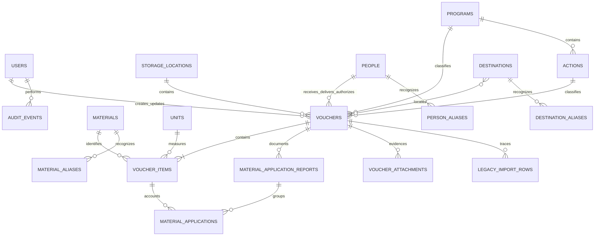

# Arquitectura y modelo de datos

## Vista general

La aplicación es un monolito Laravel con páginas Inertia y React. No existe una API pública separada.

```text
Navegador React/TypeScript
        │ Inertia + formularios HTTP
        ▼
Rutas web protegidas por sesión, CSRF y correo verificado
        ▼
Controladores Laravel ── políticas, validación y transacciones
        ▼
Servicios de dominio y modelos Eloquent
        ▼
PostgreSQL + almacenamiento privado de adjuntos
```

- Laravel controla autenticación, autorización, validación, transacciones y descarga privada.
- React renderiza formularios, catálogos, detalle de vales, dashboard y seguimiento.
- PostgreSQL conserva documentos, movimientos, catálogos, auditoría y trazabilidad de importación.
- OpenSpout se utiliza para leer y generar XLSX sin cargar libros completos en memoria.

## Servicios de dominio

- `Normalizer`: genera claves comparables para folios, materiales, ubicaciones y personas.
- `VoucherSequence`: detecta huecos numéricos por tipo a partir de los inicios configurados. Las trazas inválidas pueden extender el último folio observado, pero nunca cuentan como folios presentes.
- `VoucherData`: construye el contrato de presentación de un vale y calcula los estados de sus partidas.
- `MaterialTracking`: aplica el corte de 2026 y agrega partidas por material/unidad o por técnico.
- `LegacyControlWorkbook`: lee únicamente las hojas de Almacén y Patio y selecciona agosto de 2026.
- `ImportLegacyControl`: valida, prepara y escribe la importación histórica dentro de una transacción.

La pantalla y el XLSX de seguimiento consumen el mismo agregador para evitar resultados divergentes.

Las consultas de vales y seguimiento comparten el mismo alcance por tipo de vale. El parámetro `voucher_type_id` acepta un identificador activo o `all`; cuando se omite, el sistema usa Almacén (`warehouse`). El frontend conserva este alcance en ordenamiento, paginación, enlaces de detalle y exportación, y actualiza los resultados mediante visitas parciales de Inertia. El resumen no acepta este filtro: siempre agrega Almacén y Patio en un panorama general.

Seguimiento y su exportación aceptan el parámetro textual `search`. La búsqueda localiza vales completos por folio, técnico receptor, destino, descripción de actividad o material y se combina con los demás filtros activos.

## Relaciones principales



## Diccionario resumido

| Tabla                          | Responsabilidad                                                                                                    |
| ------------------------------ | ------------------------------------------------------------------------------------------------------------------ |
| `users`                        | Cuentas autorizadas. `is_active` bloquea inmediatamente el acceso.                                                 |
| `storage_locations`            | Implementación interna del catálogo “Tipo de vale”, actualmente Almacén o Patio.                                   |
| `material_storage_location`    | Relación editable que limita qué materiales se pueden capturar en cada tipo de vale.                               |
| `units`                        | Unidad estructurada usada para cantidades.                                                                         |
| `materials`                    | Catálogo canónico; conserva unidad habitual y bandera de revisión.                                                 |
| `material_aliases`             | Variantes históricas que apuntan al material canónico.                                                             |
| `people`                       | Técnicos y personal; sus banderas indican quién recibe, entrega o autoriza.                                        |
| `person_aliases`               | Escrituras alternativas de una misma persona.                                                                      |
| `programs`                     | Programa opcional exclusivo del vale de Almacén, inicialmente SPM-06.                                              |
| `actions`                      | Acción opcional de Almacén subordinada a un programa, inicialmente SPM-06-01.                                      |
| `destinations`                 | Ubicaciones geográficas reutilizables, activables y normalizadas.                                                  |
| `destination_aliases`          | Abreviaturas, nombres alternativos o anteriores que apuntan a una ubicación canónica; nunca contienen actividades. |
| `destination_voucher`          | Relación de una o varias ubicaciones con cada vale.                                                                |
| `vouchers`                     | Cabecera del documento, estado, revisión y responsables.                                                           |
| `voucher_items`                | Material, unidad, descripción histórica y cantidad entregada.                                                      |
| `material_application_reports` | Datos comunes y evidencia opcional de una aplicación capturada en bloque.                                          |
| `material_applications`        | Cantidad aplicada a una partida; una anulación conserva fecha, usuario y motivo.                                   |
| `voucher_attachments`          | Metadatos de evidencia guardada en almacenamiento privado.                                                         |
| `audit_events`                 | Valores anteriores y posteriores de operaciones sensibles.                                                         |
| `legacy_import_rows`           | Copia del renglón original, incidencias y vínculo al registro importado.                                           |
| `inventory_adjustments`        | Infraestructura reservada de inventario físico; no tiene rutas activas.                                            |

## Invariantes

- `vouchers(storage_location_id, folio_key)` es único. `folio_key` deriva del folio normalizado.
- Las cantidades utilizan decimal con tres posiciones y deben ser positivas al capturarse.
- Una aplicación nueva no puede superar el pendiente; las partidas se bloquean durante la transacción para evitar carreras.
- Una aplicación anulada deja de afectar las sumas, pero permanece auditable.
- No se puede reducir una partida por debajo de lo ya comprobado ni eliminarla si posee movimientos vigentes.
- Un vale con movimientos vigentes no puede cancelarse.
- Un cancelado mínimo puede crearse sin movimiento, personas, destino ni partidas para conservar la serie física.
- Un prestado mínimo sólo conserva tipo, folio, fecha y un nombre libre opcional; nunca se deriva de un vale operativo ni admite partidas.
- Un vale operativo requiere al menos una ubicación o una descripción de uso o actividad; ambas pueden coexistir.
- Los vales de Patio siempre conservan `program_id` y `action_id` en `null`; únicamente Almacén admite esa clasificación.
- Las aplicaciones conservan un resumen del destino existente al momento de registrarse, aunque el vale se edite después.
- La continuidad numérica inicia por defecto en Almacén `16576` y Patio `3753`; los inicios se configuran por entorno.
- Sólo las salidas activas desde `2026-01-01` alimentan el seguimiento. Entradas, prestados y cancelados quedan fuera.
- Las agregaciones cuantitativas se separan por `material_id` y `unit_id`.
- El total abstracto de “materiales” mostrado en la fila resumida de Seguimiento se calcula únicamente en el frontend sobre las partidas filtradas. Es una ayuda visual y no forma parte del contrato agregado, los saldos contables ni el XLSX.
- Los adjuntos residen en el disco privado y sólo se descargan después de autorizar el vale.

## Estados derivados

```text
partida pendiente     pendiente > 0
partida liquidada     pendiente = 0
partida inconsistente pendiente < 0

vale inconsistente    alguna partida inconsistente
vale pendiente        ninguna inconsistente y alguna pendiente
vale liquidado        todas sus partidas liquidadas
```

Las entradas usan el estado informativo `received`. Los vales cancelados usan `cancelled` y los prestados usan `loaned`; ambos reservan numeración y quedan fuera del seguimiento operativo.

## Seguridad y permisos

Todas las rutas operativas requieren sesión y correo verificado. Las políticas y gates permiten operar únicamente a cuentas activas. El MVP tiene un solo nivel de permisos; cualquier cuenta activa puede gestionar vales, catálogos y reportes. Laravel proporciona CSRF, regeneración de sesión, hashing de contraseñas y rate limiting del acceso. Dos factores y passkeys están disponibles como opciones de la cuenta.

Esta arquitectura es suficiente para el MVP de una usuaria, pero no representa separación de funciones. Antes de incorporar almacén, técnicos u otras áreas debe diseñarse un modelo de roles.
